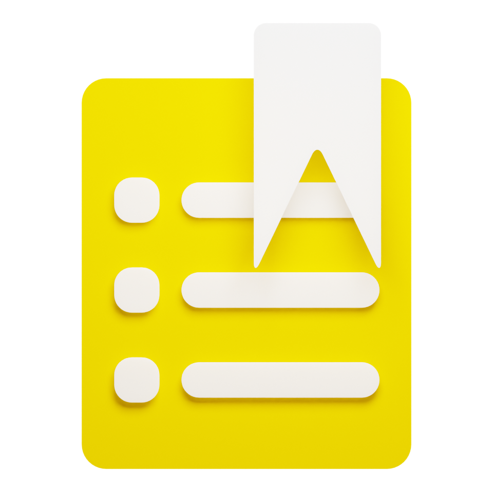

#   Notes
App saves data in files, every task is saved in each file. In the app start up app loads all this files and makes a list of tasks. User is able to create new task, edit or delete task also task is able to be marked as 'done'
In future maybe will be created a multiuser version. I mean one user is not able to read other users' tasks, something like safety and one user can login as another user in the same PC and login in the app will be able to enter his profile   
This app will have both GUI and terminal versions. Terminal version mostly will be used for testing the app but both will be able to be used as well (they will be different apps)

# About me
My name is Gavrilov Pavel, I'm just a student which started to learn programming not many time ago
I create this project for CuvSU's "IT-ring"
I hope I will win this year

# Why Notes?
At first I do it for my own use. Only after it - for "IT-ring".
To-do list is one of the most easy apps for creating. In this app user data just is saving to files. Also, as I said earlier, I want GUI for it. This way I want to improve my skills.

